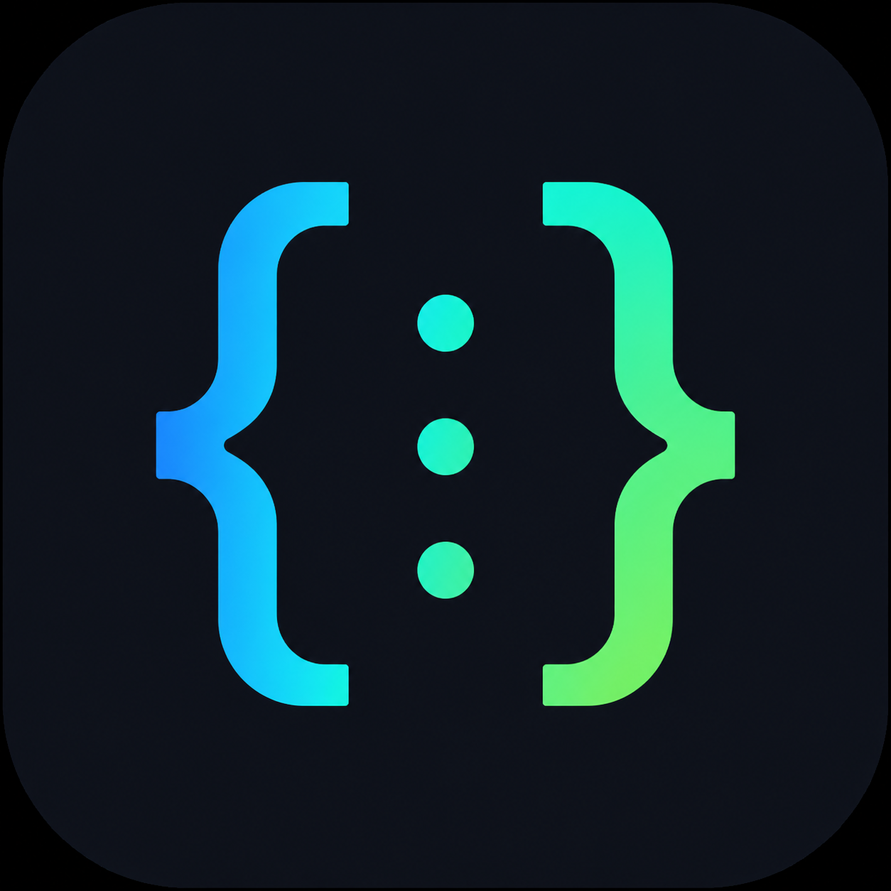

  

<h1 align="center">JSON Assistant</h1>

  <strong>Get around big JSON files in seconds.</strong> 
  A VS Code extension to jump to nested paths, browse a live outline, find where a key is used in your code and catch duplicates.

  
  
  
  
  

  <a href="https://marketplace.visualstudio.com/items?itemName=oldjazjef.json-assistant"><strong>Install from the Marketplace</strong></a>
  &nbsp;·&nbsp;
  <a href="https://github.com/oldjazjef/vscode-json-tools/releases">Releases</a>
  &nbsp;·&nbsp;
  <a href="CHANGELOG.md">Changelog</a>

---

## Why

Configuration files, translation bundles and API fixtures grow until nobody can find anything in them. JSON Assistant adds the navigation JSON has always been missing in the editor.

|     | Feature             | What you get                                                                                       |
| --- | ------------------- | -------------------------------------------------------------------------------------------------- |
| 🔎  | **Search Path**     | Type `settings.editor.fontSize` and land on exactly that property (`Ctrl+Alt+J` / `Cmd+Alt+J`)     |
| 🌳  | **JSON Outline**    | A live tree of the open file in the sidebar, with instant filtering                                |
| 🧭  | **Find References** | Every place in your code that reads a JSON path: `config.a.b`, `t('a.b')`, `_.get(obj, 'a.b')`     |
| 👯  | **Duplicate Keys**  | Gutter markers and a dedicated view for repeated keys, attributes and key-value pairs              |
| 🤖  | **Merge for AI**    | Turn a group of duplicates into a ready-to-paste refactoring instruction                           |

The full tour, with the path syntax and every setting, is on the [Marketplace page](https://marketplace.visualstudio.com/items?itemName=oldjazjef.json-assistant) (source: [MARKETPLACE.md](MARKETPLACE.md)).

## Install

- **Marketplace:** open the Extensions view in VS Code (`Ctrl+Shift+X`), search for **JSON Assistant**, click _Install_.
- **Command line:** `code --install-extension oldjazjef.json-assistant`
- **From a file:** download the `.vsix` of a [release](https://github.com/oldjazjef/vscode-json-tools/releases) and run _Extensions: Install from VSIX…_ in the Command Palette.

Requires VS Code 1.125 or newer.

## Contributing

Bug reports and ideas are welcome in the [issue tracker](https://github.com/oldjazjef/vscode-json-tools/issues). To work on the code, build it, run the tests or cut a release, see [CONTRIBUTING.md](CONTRIBUTING.md).

## Trust and security

- [SECURITY.md](SECURITY.md) explains how to report a vulnerability and summarises the supply-chain practices below.
- Every CI run audits production dependencies and verifies npm registry signatures.
- [Dependency Review](.github/workflows/dependency-review.yml) blocks pull requests that introduce a dependency with a known vulnerability, and [Dependabot](.github/dependabot.yml) keeps packages and GitHub Actions current. Workflows pin actions to a commit SHA.
- [OpenSSF Scorecard](.github/workflows/scorecard.yml) runs weekly and the badge above shows the result.
- Each GitHub release carries a CycloneDX SBOM next to the `.vsix`.

## License

[MIT](LICENSE)
